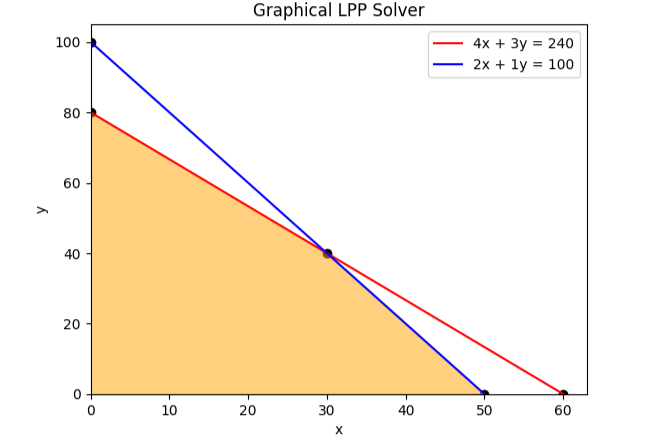

# Optimization-Python

A collection of classic optimization problems solved using Python.

This project demonstrates how to formulate and solve optimization problems using libraries like **PuLP**, **SciPy**, and **matplotlib** for visualizations.

---

## Problems Covered

### 1. Linear Programming Problem (LPP)
- Solved using **PuLP**
- Supports constraints: `≤`, `≥`, `=`
- Maximization & Minimization problems
- [See the code](notebooks/lpp.ipynb)

### 2. Graphical Method for LPP (2D only)
- Plotted feasible region and optimal solution
- Uses **matplotlib**
- [See the code](lpp_graphical_method.ipynb)
- 

### 3. Transportation Problem
- Formulated as LPP and solved using PuLP
- Handles supply and demand balance/unbalance cases
- [See the code](notebooks/transportation.ipynb)
### 4. Assignment Problem
- Solved using:
  - **Hungarian Method** (via `scipy.optimize.linear_sum_assignment`)
  - **LPP formulation** (via PuLP)
- [See the code](notebooks/assignment.ipynb)
---

## How to Run?

Follow these steps to set up and run the project on your local machine.

- Clone the repo
```bash
git clone https://github.com/sushruta19/Optimization-Python.git
cd Optimization-Python
```

- Create Virtual Env
```bash
python -m venv venv
```
- Activate Virtual Env
```bash
venv\Scripts\activate           # On Windows powershell
venv\Scripts\activate.bat       # On Windows CMD
source venv/bin/activate        # On linux bash
```
- Install requirements
```
pip install -r requirements.txt
```

- Run Jupyter Lab or Notebook
```
jupyter-lab                     # if you have installed this
jupyter-notebook
```


